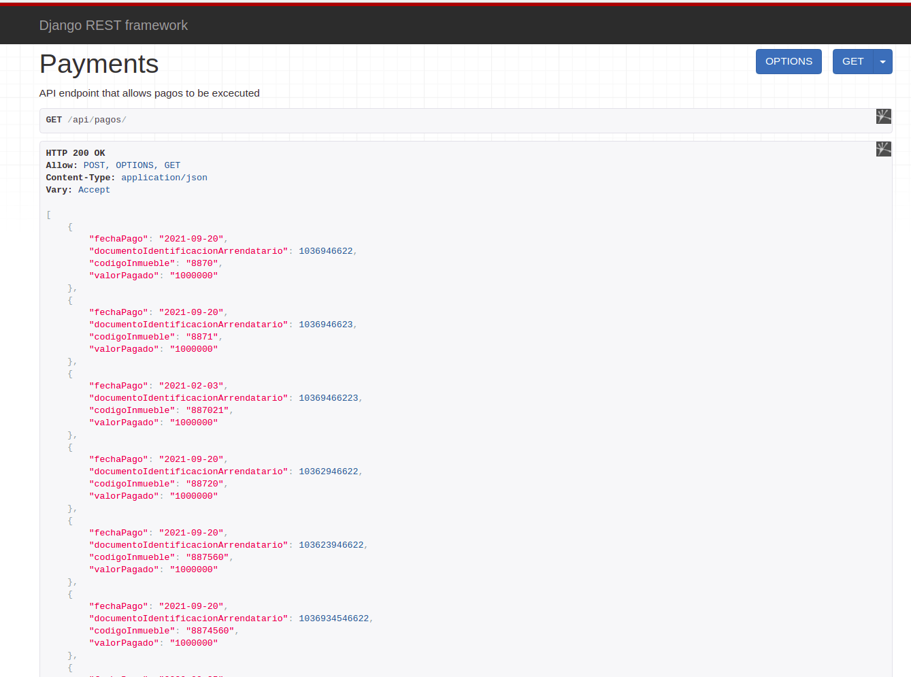
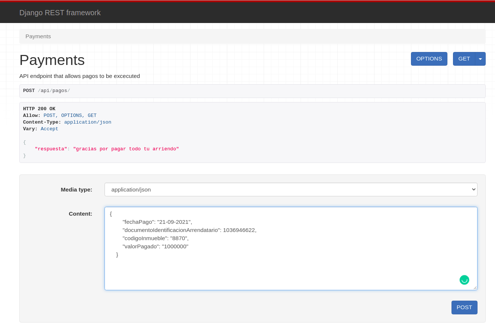

# PAGO ARRENDAMIENTOS  
> Api para pago de arrendamientos  

Una API que permite a los usuarios realizar pagos de arrendamiento asociados a sus datos personales y los  
datos del inmueble, el valor total del canon es de 1000000(un millon de pesos) y se pueden realizar  
abonos parciales a partir de 1(un peso), si se realizan abonos, se irán descontando del valor total del  
arrendamiento hasta completar su valor total, con cada abono se le recordará el saldo pendiente.  

## Preview  
**localhost:8084/api/pagos/**  

**GET**  
> GET /api/pagos  

consulta del listado de pagos  

    

**POST**  
> POST /api/pagos  

permite el registro de pagos  

  

## Configuraciones Iniciales  

### Entorno  
* Python 3.6  
* django 3  
* django-rest_framework  

### mysql console commands  
>  CREATE DATABASE `db_lease`;  
> GRANT ALL PRIVILEGES ON db_lease.* TO customer@localhost IDENTIFIED BY 'customer';  
> GRANT ALL PRIVILEGES ON test_db_lease.* TO customer@localhost IDENTIFIED BY 'customer';  

### local console commands
> unzip the file /lease_payment/pago_arrendamientos   
> install requeriments  
pip3 install -r requirements.txt  
**/lease_payment $**
> python3 manage.py runserver  
    * run project server  

### Tests 
corre el siguiente comando 
**/lease_payment/pago_arrendamientos $**  
> pytest -v  

